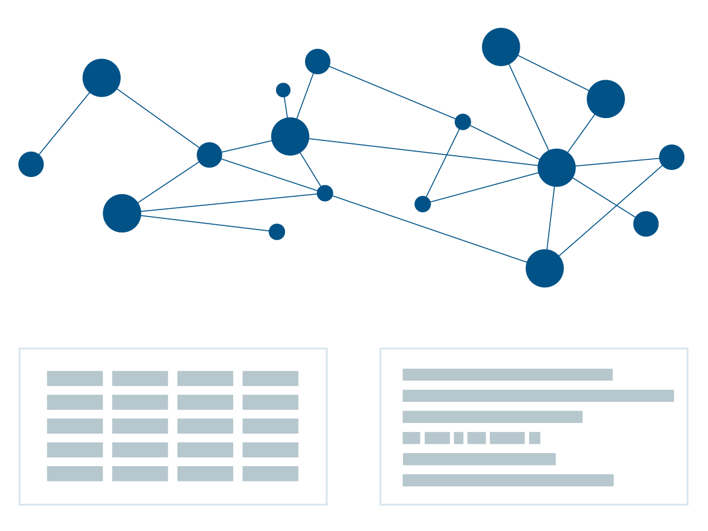

<h1 align="center"><b>Knowledge Graph-Powered Job Post Question Answering System</b></h1>
<h3 align="center"><b>HCMUS - NLP Group Project - Semester II/2023-2024</b></h3>

<h5 align="center">
  
  [](https://huggingface.co/spaces/haihuynh/Job-KnowledgeGraph-QA)
  
</h5>

<p align="center"> 
  
</p>

## :book: **Table of Contents**
- [Introduction](#pencil-introduction)
- [Usage](#fork_and_knife-usage)
    - [Clone the github repo](#clone-the-github-repo)
    - [Install requirements](#install-requirements)
    - [Scrape job posts from Indeed](#scrape-job-posts-from-indeed)
    - [Construct & Update Knowledge Graph](#construct--update-knowledge-graph)
    - [QA with LLM](#qa-with-llm)
- [Components](#package-components)
    - [Data Collection Module](#data-collection-module)
    - [Knowledge Graph Module](#knowledge-graph-module)
    - [Inference Module](#inference-module)
- [Key Features](#key-key-features)
- [References](#books-references)
- [Tech Stack](#hammer_and_wrench-tech-stack)
- [Demo](#computer-demo)


## :pencil: Introduction 
This project aims to develop a question answering system that can provide comprehensive and informative responses to queries related job postings. The core component of this system is a knowledge graph meticulously constructed from a vast amount of job postings. This knowledge graph serves as a robust Retrieval Augmented Generation (RAG) engine, enabling an advanced language model to effectively extract and process relevant information.


## :fork_and_knife: Usage
###  Clone the github repo
```bash
git clone https://github.com/hari-huynh/MultiHop-QA-KnowledgeGraph.git
```

###  Install requirements
```bash
pip install requirements.txt
```
### Scrape job posts from Indeed
The knowledge graph is constructed from job posts scraped from Indeed. To scrape job post information from Indeed, use the following code:
```bash
cd knowledge_graph
python scrape_jd.py --url "indeed-url-for-scraping" --job "role-that-you-want-to-scrape" --loc "the-location"
```

Example:
```bash
python scrape_jd.py --url "https://vn.indeed.com/jobs" --job "Artificial Intelligence" --loc "Thành phố Hồ Chí Minh"
```
The result will be a JSON file containing several job posts and the corresponding information, such as titles, company names and job descriptions. See examples in the ```job_posts_data``` inside ```knowledge_graph``` folder.

### Construct & Update Knowledge Graph
```bash
python update_kg.py
```
This will create a knowledge graph with a predefined schema (If the knowledge graph hasn't been created yet) or update the knowledge graph with new data.


### QA with LLM
After having a knowledge graph filled with job post information, you can now start asking about job post related questions.
```bash
cd react_agent
python main.py
```

## :package: Components
### Data Collection Module
This module is responsible for automaticaly scraping and collecting job post data on a daily basis.


### Knowledge Graph Module
This module acts as an information processor. It extracts entities and relationships from incoming data, and then uses this information to update the knowledge graph itself.


### Inference Module
This module is responsible for generating responses to user's queries. A ReAct agent with 2 tools (Knowledge Graph Search and Tavily Search) is the core of this module.


## :key: **Key Features**

- Ask and answer detailed information about available jobs both within and outside the knowledge base: required skills, experience, etc.

- Ask and answer information about the company: position, field, etc.

- Ask and answer reasoning related to job information.

- Suggest suitable jobs.

## :books: **References**
[1] Lewis, Patrick, et al. "Retrieval-Augmented Generation for Knowledge-Intensive NLP Tasks." ArXiv, 2020,  /abs/2005.11401. Accessed 3 Jul. 2024. [https://ar5iv.labs.arxiv.org/html/2005.11401]

[2] Hogan, Aidan, et al. "Knowledge Graphs." ArXiv, 2020,  https://doi.org/10.1145/3447772. Accessed 3 Jul. 2024.

[3] Yao, Shunyu, et al. "ReAct: Synergizing Reasoning and Acting in Language Models." ArXiv, 2022,  /abs/2210.03629. Accessed 3 Jul. 2024. [https://arxiv.org/abs/2210.03629]

[4] Team, Gemini, et al. "Gemini: A Family of Highly Capable Multimodal Models." ArXiv, 2023,  /abs/2312.11805. Accessed 3 Jul. 2024. [https://arxiv.org/abs/2312.11805]

[5] https://www.superannotate.com/blog/llm-agents

## :hammer_and_wrench:  **Tech Stack**
<div align="center">
  <a href="https://github-readme-tech-stack.vercel.app">

  </a>
</div>

## :computer: Demo
https://github.com/user-attachments/assets/ab38ee0e-3fc0-448f-96ae-346a2fbb6666

## :handshake:  **Contributors**
<table>
<tr>
    <td align="center" style="word-wrap: break-word; width: 150.0; height: 150.0">
        <a href=https://github.com/hari-huynh>
            
            <br />
            <sub style="font-size:14px"><b>hari-huynh</b></sub>
        </a>
    </td>
      <td align="center" style="word-wrap: break-word; width: 150.0; height: 150.0">
        <a href=https://github.com/QuangTruong-Nguyen>
            
            <br />
            <sub style="font-size:14px"><b>QuangTruong-Nguyen</b></sub>
        </a>
    </td>
      <td align="center" style="word-wrap: break-word; width: 150.0; height: 150.0">
        <a href=https://github.com/TaiQuach123>
            
            <br />
            <sub style="font-size:14px"><b>TaiQuach123</b></sub>
        </a>
    </td>
</tr>
</table>
